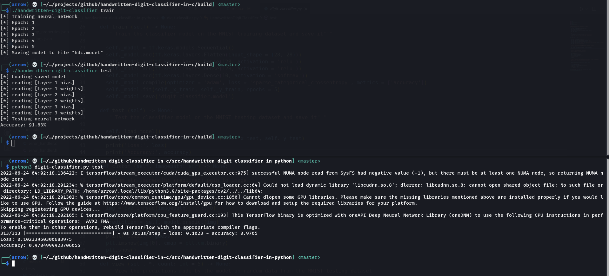
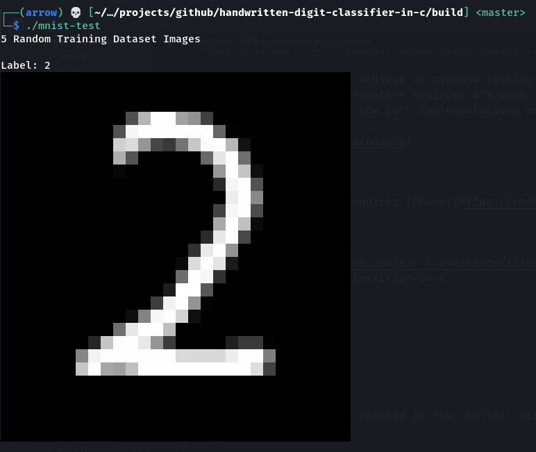

# handwritten-digit-classifier

Inspired by the [3Blue1Brown neural network series](https://youtube.com/playlist?list=PLZHQObOWTQDNU6R1_67000Dx_ZCJB-3pi), this is an implementation of a neural network that tries to classify Handwritten Digits.

The neural network makes use of the [MNIST dataset](https://www.kaggle.com/datasets/oddrationale/mnist-in-csv). Training is done by iterating over the entire dataset for 5 epochs, calculating losses for each epoch and performing gradient descent backpropagation.

The network manages to achieve an average testing accuracy of 91% (the best accuracy I've seen in all my testing was 93%). Constructing a similar network structure with same parameters achieves 97% when using Tensorflow, which is quite a lot and something that I look forward to achieving with my own implementation. Here's how both implementations perform on the MNIST testing dataset:



<br />

Building the program requires [CMake](https://cmake.org/).

```bash
# clone the repository
git clone https://github.com/a-r-r-o-w/handwritten-digit-classifier-in-c
cd handwritten-digit-classifier-in-c

# build the binaries
mkdir build
cd build
cmake ..
make
```

The binaries should be created in the `build/` directory and can be executed to replicate the results mentioned above.

```bash
./matrix-test
./mnist-test
./handwritten-digit-classifier
```

_Note: `./mnist-test` requires that the terminal supports ANSI Escape Codes. If your terminal does support it, the output may look something like:_


