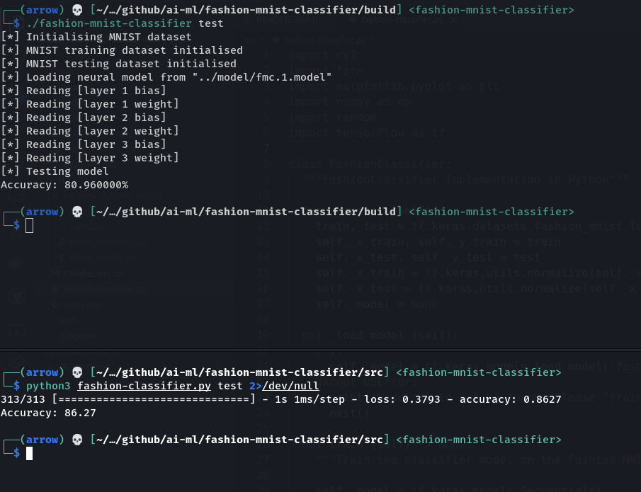

# fashion-mnist-classifier

This is an implementation of a very simple feedforward neural network that learns using backpropagation. The network attempts to learn and classify the [Fashion MNIST dataset](https://www.kaggle.com/datasets/zalando-research/fashionmnist).

The network achieves an accuracy of about 79-81% (the best accuracy I've seen in local testing was 83%). The similar equivalent of the network made using Tensorflow achieves an accuracy of about 87%. Here's how the implementations perform on the fashion dataset:



<br />

Building the program requires [CMake](https://cmake.org/).

```
# clone the repository
git clone https://github.com/a-r-r-o-w/ai-ml
cd ai-ml/fashion-mnist-classifier

# build the binaries
mkdir build
cd build
cmake ..
make

# the previous step should have created three executable binaries

# execute binaries
./matrix-test
./mnist-test
./fashion-mnist-classifier

# remember to download the fashion mnist dataset and save it in ../res/datasets/
# ./mnist-test requires that your terminal supports ANSI escape codes
```

There is much work that I could do in order to improve the performance, accuracy, runtime, etc. of the network and I intend to do it some time in the future as I learn and explore more about neural networks and other things in AI research.
